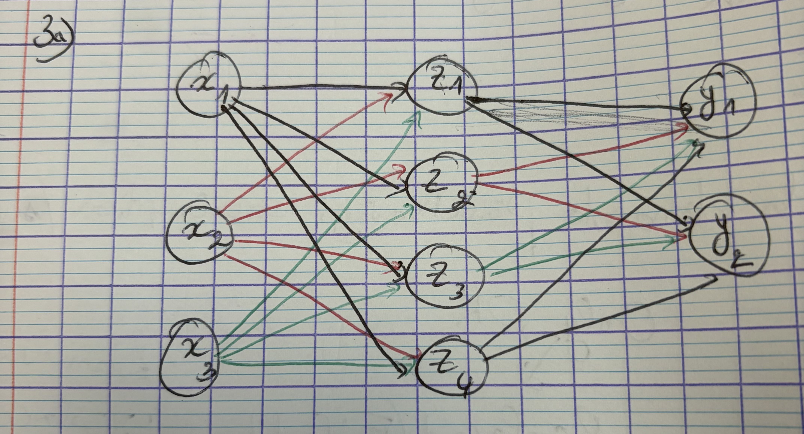
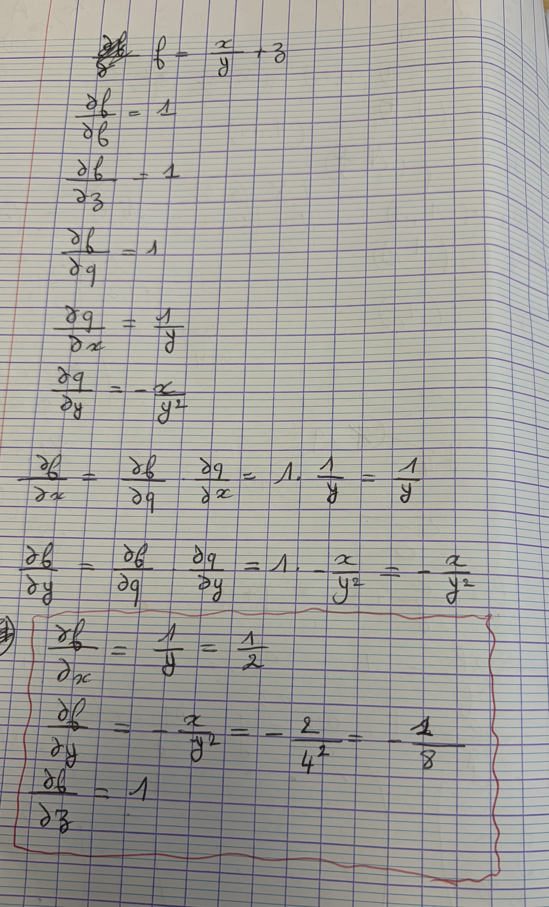
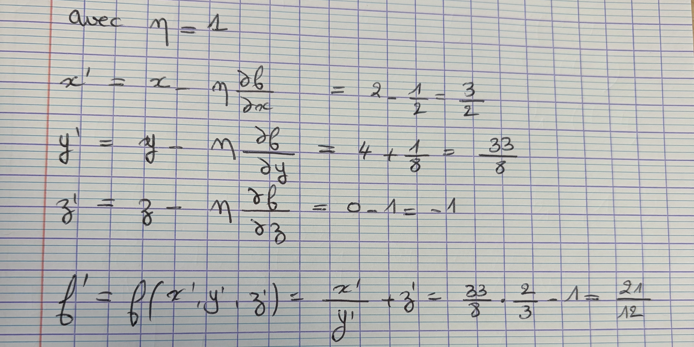
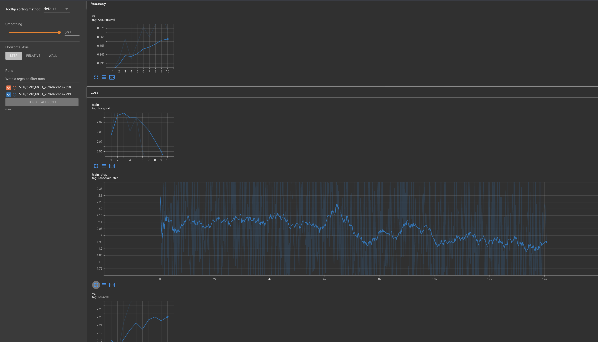
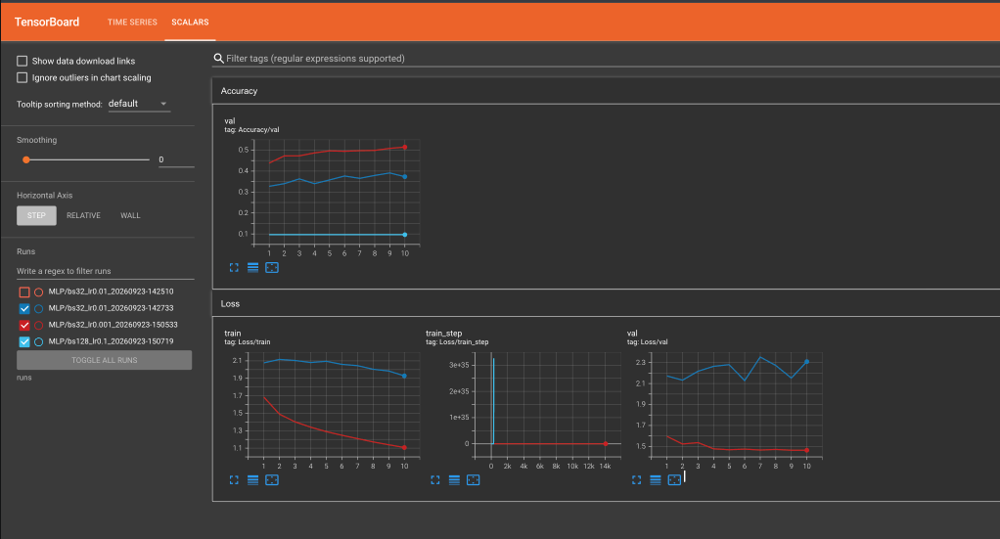

# Introduction au Deep Learning
## Exercice 1 
## Q1.c 
Le modèle de GPU alloué est une **NVIDIA L4** 
## Q1.d
```bash
scancel 1535
```
le nom du fichier logs : hello-slurm-1539.out
## Q1.g
Le ReqMem est la Ram demandé qui est 8 Go
Le MaxRSS est la valeur maximael utilisée  par le job lors de son exécution
## Exercice 2 
## Q2.b
La version de Python utilsée est Python 3.10.21 qui a été vérifiée avec cette commande 
```bash 
python --version 
```
La commande utilisée est 
```bash
which python
```
pour avoir le chemin binaire suivant 
/mnt/hdd/homes/ewalha/miniforge3/envs/deeplearning/bin/python

## Q2.d
La sortie du script check_gpu.py : 
PyTorch version: 2.14.0+cu130
CUDA available: True
Device count: 1
Device 0 name: NVIDIA L4
## Q2.f 
La version de TensorBoard est  .
2.21.0 qui a été affichée avec cette commande 
```bash
tensorboard --version
```
## Exercice 3
## Q3.a


## Q3.b
X: (N,3)
W1: (N,1)
b1: (1,t) -> diffusé en (N, t)
H:(N,t)
W2:(z,t)
b2:(1,z)-> diffusé en (N, z)
Y:(N,z)
## Q3.C

## Q3.d

## Q3.e
On utilise le règle de la chainene parce que ça permet de calculer le gradient en reliant les dérivées de chaque couche et donc propager l'erreur de la sorti jusqu'aux différentes couches 

Traiter l'ensemble total des données  est trop lourd pour la mémoire et faire  un seul exemple à la fois prend trop de temps . Le mini-batch est alors  le juste milieu : il permet de calculer plusieurs données en parallèle tout en gardant une direction d'apprentissage stable.
## Q3.f

| Tâche                  | Fonction finale (Sortie) | Fonction de perte (Loss)   |
|------------------------|--------------------------|----------------------------|
| Classification binaire | 1. Sigmoïde              | A. Binary Cross-Entropy    |
| Classification multi   | 2. Softmax               | B. Cross-Entropy           |
| Régression pure        | 3. Identité (aucune)     | C. MSE (Mean Squared Error)|

## Exercice 4
## Q4.a
`batch_size` est le nombre d'exemples traités ensemble dans un mini-batch : le modèle fait une passe avant/arrière et une mise à jour des poids par batch.

`shuffle` mélange aléatoirement l'ordre des exemples à chaque époque.

En entraînement, `shuffle=True` permet d'avoir des mini-batchs différents à chaque époque, ce qui évite que le modèle apprenne l'ordre des données et améliore la généralisation.
En test, `shuffle=False` car on n'apprend rien : l'ordre ne change pas le résultat, et on garde une évaluation reproductible.

## Q4.b
1. Les images arrivent sous la forme (N, 3, 32, 32) alors que `nn.Linear` attend une matrice 2D (N, nb_features). `torch.flatten(x, 1)` aplatit toutes les dimensions à partir de la dimension 1, ce qui donne (N, 3072) en conservant la dimension du batch.

2. `nn.CrossEntropyLoss` applique déjà un LogSoftmax sur les logits avant de calculer la perte. Ajouter un Softmax dans le réseau l'appliquerait deux fois, ce qui écrase les sorties, affaiblit les gradients et ralentit l'apprentissage.

## Q4.c
`loss.backward()` calcule les gradients de la perte par rapport à chaque paramètre et les accumule dans `.grad`.
`optimizer.zero_grad()` remet ces gradients à zéro avant chaque batch, pour que les gradients du batch précédent ne s'additionnent pas à ceux du batch courant.

Résultat de l'entraînement : accuracy train = 0.426 après 10 époques, accuracy test = 0.389.

## Q4.d
1. `torch.no_grad()` désactive le calcul et le stockage du graphe des gradients, inutiles en évaluation puisqu'on ne met pas les poids à jour. On utilise donc moins de mémoire GPU et l'évaluation est plus rapide.

2. CIFAR-10 contient 10 classes équilibrées, donc un classificateur aléatoire obtiendrait environ 1/10 = 10 % d'accuracy. Notre modèle (38,9 %) fait nettement mieux.


## Exercice 5
## Q5.a
Inclure la date, l'heure et les hyperparamètres dans le nom du dossier de logsrend le  unique à chaque entraînement et dinc  un nouveau run n'écrase pas les précédents. 
## Q5.b


À un smoothing d'environ 0.97, on distingue clairement la tendance de la loss (plateau vers 2.1 puis baisse vers 1.95) sans masquer ses variations importantes.

Loss/train_step est plus bruitée car chaque point correspond à un seul mini-batch de 32 exemples, alors que Loss/train est une moyenne sur les 45000 exemples de l'époque.
## Q5.c


1. Le run 2  donne la meilleure accuracy en validation : 0.51, avec des pertes qui diminuent régulièrement.
Le run 1 est instable : la loss reste autour de 2.0 et la val_acc plafonne vers 0.37.
Le run 3 diverge : la loss explose puis devient `nan` dès la première époque, et l'accuracy tombe à 0.096 . Le learning rate est trop grand.

2. On détecte un sur-apprentissage quand la loss d'entraînement continue de baisser alors que la loss de validation stagne puis remonte : l'écart entre les deux courbes se creuse. On l'observe sur le run 2 : à partir de l'époque 5, Loss/train continue de descendre (1.29 → 1.11) alors que Loss/val stagne .