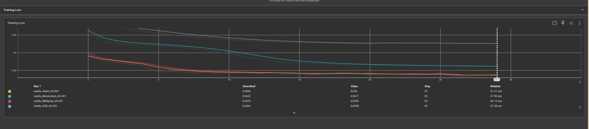

# Régularisation, optimisation et métriques
## Exercice 1
## Q1.
Ceci est une mauvaise pratique parce que Le StandardScaler() calcule la moyenne et l'écart type à partir de l'ensemble du dataset donc il utilse ausssi les données de test avant l'entrainement du modèle d'où le data leakage 
## Q2.
On utilse à la place de Dataset IterableDataset qui permet de lire les données progressivement sans charger tout le datset en mémoire 
## Exercice 2
## Q1.
Avec l1_lambda=0.1 et l2_lambda=0, la loss explose au début (6.72) puis reste bloquée à 1.6340 à partir de l'epoch 2 donc le modèle n'apprend plus du tout.
## Q2. 
C'est l'argument weight_decay de optim.SGD qui permet d'appliquer cette régularisation L2 automatiquement.

## Q3.
 Le L1 pousse certains poids à devenir exactement 0, donc il fait une sorte de sélection de features . Le L2 au contraire réduit tous les poids un peu, sans jamais les annuler complètement .

 ## Exercice 3
 ## Q1.
 
 ## Q2.
 Adam converge le plus rapidement au début (suivi de très près par RMSprop) les deux chutent nettement plus vite que SGD et Momentum
 ## Q3. 
 Momentum converge plus vite et atteint une loss finale plus basse que SGD simple (0.56 contre 0.63) . Il accélère et stabilise la descente de gradient. 